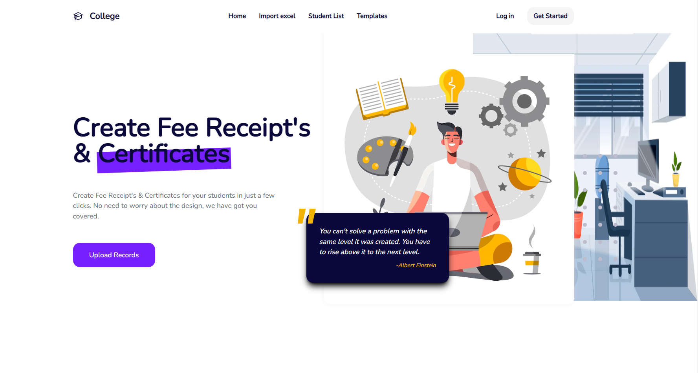

## College_ERP Project



## Commands to run the project

First move to the respective directories and then run the following commands

1. ### `yarn install` or `npm install`

- To install all the dependencies

2. ### `yarn start` or `npm start`

- To start client-side project

3. ### `yarn dev` or `npm dev`

- To start server-side project

## Project Structure

```

college_fee_receipt_and_certificate_generation

## Client-side

├── README.md
├── package.json
├── src
│ ├── assets
│ │ ├── css-flexbox-poster.png
│ │ ├── favicon.ico
│ │ ├── logo192.png
│ │ ├── logo512.png
│ │ ├── manifest.json
│ │ └── robots.txt
│ ├── components
│ │ ├── App.js
│ │ ├── App.test.js
│ │ ├── index.js
│ │ ├── Top.js
│ │ ├── Buttons
│ │ │ ├── FullButton.jsx
│ │ ├── Elements
│ │ │ ├── Backdrop.jsx
│ │ │ ├── ProjectBox.jsx
│ │ ├── Nav
│ │ │ ├── TopNavbar.jsx
│ │ │ ├── Sidebar.jsx
│ │ ├── FeeReceipt
│ │ │ ├── FeeReceiptPage.jsx
│ │ │ ├── StudentList.jsx
│ │ │ ├── StudentRecord.jsx
│ │ ├── PdfTemplates
│ │ │ ├── Templates.jsx
│ │ ├── Sections
│ │ │ ├── Features.jsx
│ │ │ ├── Footer.jsx
│ │ │ ├── Header.jsx
│ │ ├── screens
│ │ │ ├── HomePage.jsx
│ │ ├── Utils
│ │ │ ├── baseUrl.jsx

## Server-side

├── README.md
├── package.json
├── index.js
├── .env
├── Database
│ ├── CertificateDatabase
│ │ ├── Certificates
│ ├── FeeReceiptDatabase
│ │ ├── FeeReceipts
│ | | ├── FeeReceipts.json
│ │ ├── studentData.json
├── documents
│ ├── feereceiptTemplate.js
│ ├── FeeReceiptpdf.html
│ ├── certificateTemplate.js
│ ├── Certificatepdf.html
├── Output
│ ├── FeeReceiptsPDF
│ ├── CertificatesPDF

```

## Database Location

All the Student Records data is stored in the `studentData.json` file in the `FeeReceiptDatabase` folder.

## Files save location

All the generated feeReceipts pdf files will be saved in the `FeeReceiptsPDF` folder in the `Output` folder.

## server/Output/FeeReceiptsPDF

All the generated certificates pdf files will be saved in the `CertificatesPDF` folder in the `Output` folder.

## server/Output/CertificatesPDF

## PDF Template Location

PDF Template is stored in the `feereceiptTemplate.js` file in the `documents` folder.
You can also checkout the `FeeReceiptpdf.html` file in the `documents` folder to see the html code of the template.

## server/documents/feereceiptTemplate.js

## Certificate Template Location

Certificate Template is stored in the `certificateTemplate.js` file in the `documents` folder.
You can also checkout the `Certificatepdf.html` file in the `documents` folder to see the html code of the template.

```

Note: The `Output` folder will be created automatically when you run the project for the first time.
```
